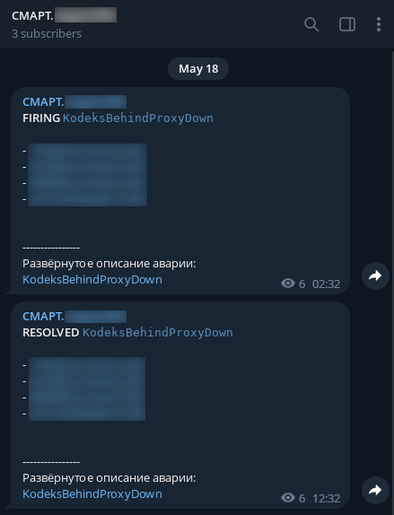

# Бизнес кейсы

## Кейс "Облака тоже могут упасть"

**Ситуация:**

Несколько установок для разных клиентов размещены на сервисе "Техэксперт.Облако".
У каждой установки свое доменный адрес.

В районе 6 утра рабочего дня по каждой установке поступают алерты:
- [KodeksBehindProxyDown](http://smart.uniclass.ru/docs/errors/KodeksBehindProxyDown.md)

В телеграм-канале это выглядит так:

Менеджер к 8 утра видит их и понимает, что установки недоступна.

**Решение:**

Менеджер пробует попасть в админку каждой установки из алерта - доступа нет.
Менеджер оповещает о недоступности в техподдержку сервиса "Техэксперт.Облако".
Заявка берется в работу.
Через несколько минут техподдержка сообщает, что произошло падение DNS-сервера.
Возможность входа в ПК сохранена если использовать IP-адреса установок, а не доменные адреса.

Менеджер оповещает клиентов об этом, хотя к этому моменту (в районе 10-11 утра рабочего дня) некоторые клиенты уже заметили неполадки и сообщили о них менеджеру.
При использовании IP-адреса вход в ПК проходит успешно.

Через 3 часа техподдержка сервиса "Техэксперт.Облако" сообщает о восстановлении работы DNS-сервера.

Менеджер проверяет этот факт, пробуя зайти в админку каждой установки.
Успешно.
Менеджер сообщает об этом пользователям, с тем чтобы они вернулись к понятным для них адресам входа в из Техэксперты.

**Выводы:**
- Плюсы:
  - СМАРТ оперативно сообщил о недоступности ПК;
  - Падение ПК не было связано с самим ПК;
  - С точки зрения пользователей временная недоступность ПК составила менее часа, что уложилось в рамки заключенного договора.
-Минусы:
  - Пользователи заметили падение ПК.

[Еще примеров!](102-smart-real-cases-3.md)

[Вернуться к Оглавлению](index.md)